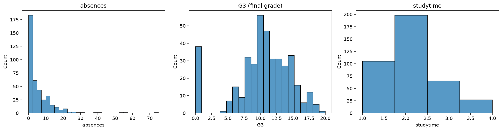
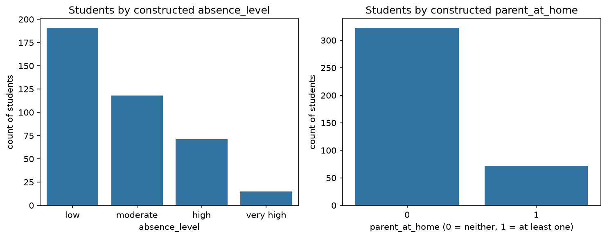

# ml-02-features

[](https://denisecase.github.io/pro-analytics-02/workflow-b-apply-example-project/)
[](./pyproject.toml)
[](./LICENSE)

> Professional Python project: engineering and selecting features for machine learning.

## Project Description

This project prepares data for machine learning by engineering and selecting features.

The custom project uses the UCI Student Performance dataset to ask a question:
can we identify students heading for a poor outcome early enough to reach them?
That question turns out to constrain the data. The two most predictive columns in the dataset
are prior period grades, and neither one exists at the moment the prediction would be useful,
so both were removed.

Two features were constructed and added: `absence_level`, a binned version of the
absence count, and `parent_at_home`, a flag for whether either parent's job is listed as
at_home.

Target: `G3`, the final grade (0 to 20). Supervised regression.
Data: 395 students, 33 columns.

## Data

Cortez, P. (2014). Student Performance [Dataset]. UCI Machine Learning Repository.
https://doi.org/10.24432/C5TG7T (CC BY 4.0)

- `data/raw/student-mat.csv` - the mathematics course file, 395 students, 33 columns.
  Semicolon-separated, so it is read with `pd.read_csv(path, sep=";")`.
- `data/raw/student.txt` - the column dictionary from UCI.

## Notebooks

- [ml_02_case.ipynb](notebooks/ml_02_case.ipynb) - the provided example (unchanged)
- [ml_02_gracecode42.ipynb](notebooks/ml_02_gracecode42.ipynb) - Phase 4, technical modification
- [ml_02_gracecode42_students.ipynb](notebooks/ml_02_gracecode42_students.ipynb) - Phase 5, custom project

## Command Reference

<details>
<summary>Show command reference</summary>

### In a machine terminal (open in your `Repos` folder)

After you get a copy of this repo in your own GitHub account,
open a machine terminal in your `Repos` folder:

```shell
git clone https://github.com/gracecode42/ml-02-features

cd ml-02-features
code .
```

### In a VS Code terminal

These are listed for convenience.
For best results, follow the detailed instructions in
[pro-analytics-02 guide](https://denisecase.github.io/pro-analytics-02/).

```shell
uv self update
uv python pin 3.14
uv lock --upgrade
uv sync --extra dev --extra docs --upgrade

uvx pre-commit install
uvx pre-commit autoupdate

git add -A
uvx pre-commit run --all-files
# repeat if changes were made
uvx pre-commit run --all-files

# run the example module to verify the environment (.venv/)
uv run python -m mlstudio.app_case

# run common chores
uv run ruff format .
uv run ruff check . --fix
uv run python -m pyright
uv run python -m pytest
uv run python -m zensical build

# save progress
git add -A
git commit -m "update"
git push -u origin main

# run the custom project notebook
# open notebooks/ml_02_gracecode42_students.ipynb in VS Code,
# select the .venv kernel, and Run All
```

</details>

## Findings and Visuals



`absences` runs from 0 to 75 with a median of 4, so a small number of students sit far from
everyone else. `G3` is roughly bell-shaped above 5, but 38 students score exactly zero, which
looks like a separate group rather than the low tail of one distribution. Neither was cleaned
or removed. A student with 75 absences or a zero final grade is not a data error, and in an
early-alert context that student is the point.



`absence_level` bins attendance at the median, the third quartile, and the 1.5 IQR fence.
The bins keep the skew of the original variable: 191 students are "low," 118 "moderate,"
71 "high," and only 15 "very high."
`parent_at_home` flags whether either parent's job is listed as at_home, which is true for
72 students.

## Project Documentation

Additional project instructions, terms, and notes:

[docs/index.md](docs/index.md)

## Citation

[CITATION.cff](./CITATION.cff)

## License

[MIT](./LICENSE)
